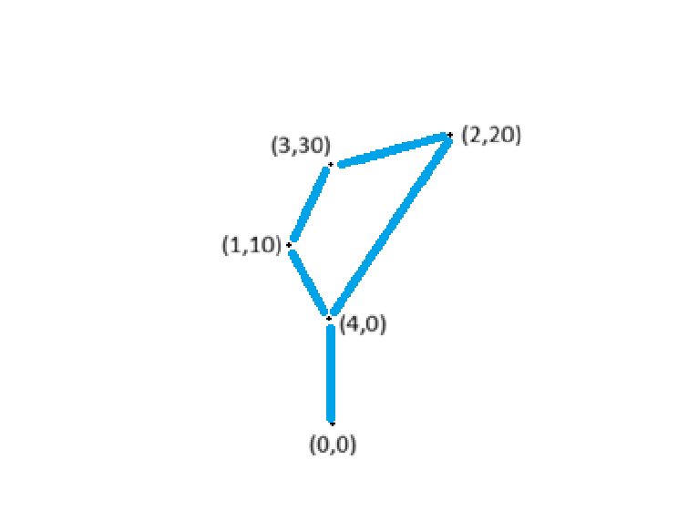

# SRC
This folder contains the code that you need to run the final solution

Genotype: lista di tour (che partono da zero e tornano a zero), escludendo le città intermedie e mantenedo dolo quelle in cui si raccoglie l'oro (le città intermedie sono quelle dei percorsi minimi precedentemente colcolate con Dikstrja)

Fenotype: lista con tutto il percorso, anche le città implicite 

esempio: 

[[ (1,10)] , [(2,20), (3,30)] ...]

[ (1,10), (4,0), (0,0) (4,0), (2,20), (3,30), (1,0), (4,0), (0,0)]
*nota:* nel fenotipo finale non devo partire per forza da una città specifica quindi tolgo tutte le città iniziali che siano deposito o abbiano costo zero 

